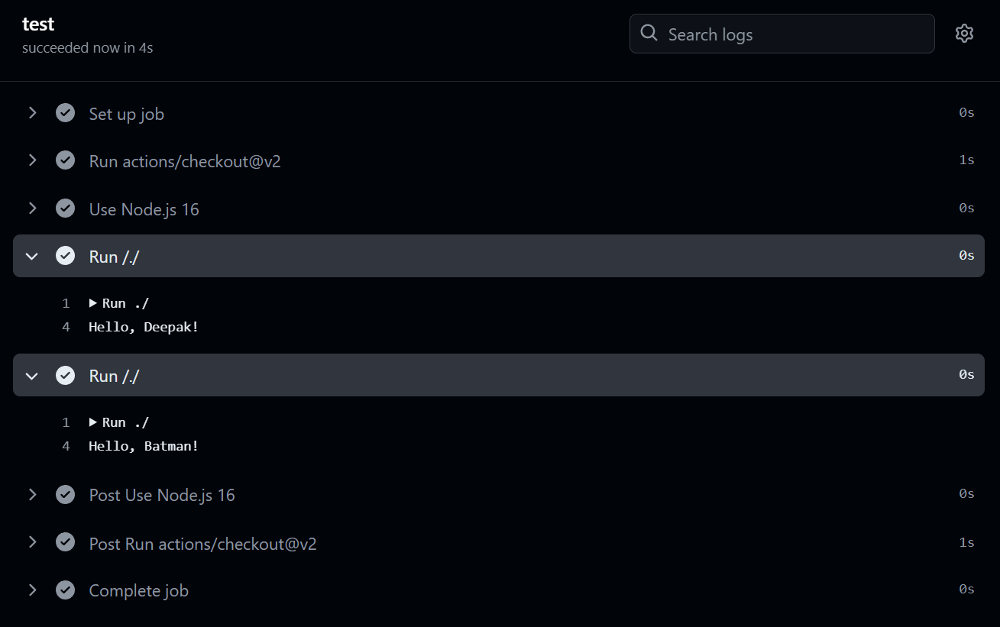

- initialize the `actions.yml`
- Add the name , description of the actions
- Then you have to mention what kind of the action it is , their are three types of actions right now javascript actions , docker images actions and the last one is `composite actions`.
Like this `action.yml`: 
```yml
name: Deepak Understanding Github Actions
description: Understanding Github Actions
runs:
  using: node16
  main: src/index.js
```

Then to create a workflow create `.github/workflows/test.yml` file to write the workflow :
```yml 
name: Test
on:
  push

jobs:
  test:
    runs-on: ubuntu-latest
    steps:
      - uses: actions/checkout@v2
      - name: Use Node.js 16
        uses: actions/setup-node@v2
        with:
          node-version: 16
      - uses: ./ # Uses an action in the root directory
```

Now we can pass the env variable to the actions ( that I discovered by myself (achievement) as INPUT_PERSON , all in capital).

We made some change in `action.yml` , and an update in index.js to expect an environment variable and print it.
```yml
name: Deepak Understanding Github Actions
description: Understanding Github Actions
inputs:
  person:
    description: 'Person to greet'
    required: true
    default: 'Deepak'
runs:
  using: node16
  main: src/index.js
```
```js
const person = process.env.INPUT_PERSON;
console.log(`Hello ${person}`);
```
now we will trigger the action.yml from the workflow file and will do two things in first case we will not pass the env variable to it and in the second time we will pass the enviroment variable to it.

```yml
name: Test
on:
  push

jobs:
  test:
    runs-on: ubuntu-latest
    steps:
      - uses: actions/checkout@v2
      - name: Use Node.js 16
        uses: actions/setup-node@v2
        with:
          node-version: 16
      - uses: ./ # Uses an action in the root directory without input this time
      - uses: ./ # Uses an action in the root directory with input this time
        with:
          person: 'Batman'

```



## Github actions toolkit
- It is a set of tools that you can use to build your actions.
- Like I tested the `@actions/core` to take the input from the user and then print it. It improves the readability of the code.
```js
const core = require('@actions/core');
const person = core.getInput('person');
console.log(`Hello, ${person}!`);
```

we have to adjust our `test.yml` to install the `@actions/core` package.
```yml
name: Test
on:
  push

jobs:
  test:
    runs-on: ubuntu-latest
    steps:
      - uses: actions/checkout@v2
      - name: Use Node.js 16
        uses: actions/setup-node@v2
        with:
          node-version: 16
      - run: npm ci ## to install the dependencies
      - uses: ./ 
      - uses: ./ 
        with:
          person: 'Batman'
```


## Utilization of github-action by some other actions
Now the problem is github don't allow us to do `npm install` once our github actions is used by some other workflow or by some other repository. Then how can we ship our actions to those workflows or repos? 
1. Commit the node_modules folder. (The most trash way !!)
2. Use a bundler that bundles everything in single javascript file and then ship that js file to the other workflows or repos (like esbuild).

We are using esbuild to bundle our code and then ship it to the other workflows or repos because it supports typescript and it is very fast.
We need to create the `esbuild.cjs` file in the root directory and then we have to write the following code in it.
```json
{
  "scripts": {
    "build": "esbuild src/index.ts --bundle --platform=node --outfile=dist/index.js"
  },
  "devDependencies": {
    "esbuild": "^0.14.10"
  }
}
```
Update the `action.yml` to use the dist/index.js file.
```yml
name: Deepak Understanding Github Actions
description: Understanding Github Actions
inputs:
  person:
    description: 'Person to greet'
    required: true
    default: 'Deepak'
runs:
  using: node16
  main: dist/index.js
```
Update the `test.yml` to run the build script before running the action then delete the node_modules and then use the dist/index.js file in the workflow.
```yml
name: Test
on:
  push

jobs:
  test:
    runs-on: ubuntu-latest
    steps:
      - uses: actions/checkout@v2
      - name: Use Node.js 16
        uses: actions/setup-node@v2
        with:
          node-version: 16
      - run: npm ci
      - run: npm run build ## to build the code
      - run: rm -rf node_modules ## to delete the node_modules
      - uses: ./
      - uses: ./ 
        with:
          person: 'Batman'
```
