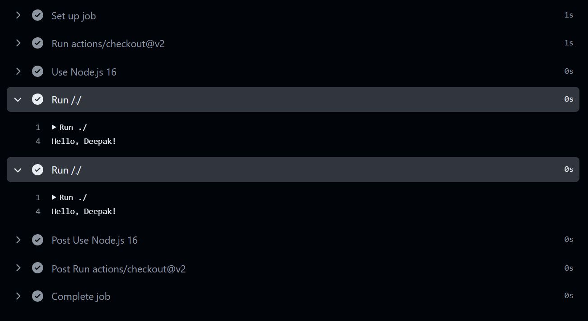

- initialize the `actions.yml`
- Add the name , description of the actions
- Then you have to mention what kind of the action it is , their are three types of actions right now javascript actions , docker images actions and the last one is `composite actions`.
Like this `action.yml`: 
```yml
name: Deepak Understanding Github Actions
description: Understanding Github Actions
runs:
  using: node16
  main: src/index.js
```

Then to create a workflow create `.github/workflows/test.yml` file to write the workflow :
```yml 
name: Test
on:
  push

jobs:
  test:
    runs-on: ubuntu-latest
    steps:
      - uses: actions/checkout@v2
      - name: Use Node.js 16
        uses: actions/setup-node@v2
        with:
          node-version: 16
      - uses: ./ # Uses an action in the root directory
```

Now we can pass the env variable to the actions ( that I discovered by myself (achievement) as INPUT_PERSON , all in capital).

We made some change in `action.yml` , and an update in index.js to expect an environment variable and print it.
```yml
name: Deepak Understanding Github Actions
description: Understanding Github Actions
inputs:
  person:
    description: 'Person to greet'
    required: true
    default: 'Deepak'
runs:
  using: node16
  main: src/index.js
```
```js
const person = process.env.INPUT_PERSON;
console.log(`Hello ${person}`);
```
now we will trigger the action.yml from the workflow file and will do two things in first case we will not pass the env variable to it and in the second time we will pass the enviroment variable to it.

```yml
name: Test
on:
  push

jobs:
  test:
    runs-on: ubuntu-latest
    steps:
      - uses: actions/checkout@v2
      - name: Use Node.js 16
        uses: actions/setup-node@v2
        with:
          node-version: 16
      - uses: ./ # Uses an action in the root directory without input this time
      - uses: ./ # Uses an action in the root directory with input this time
        with:
          person: 'Batman'

```
